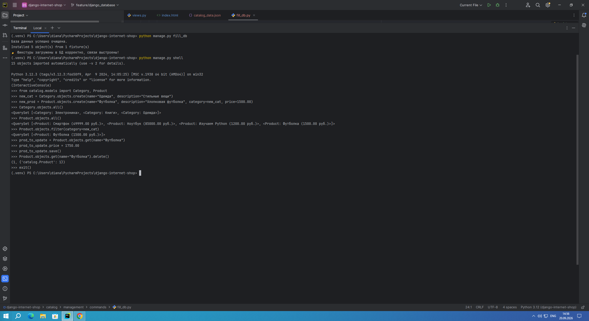
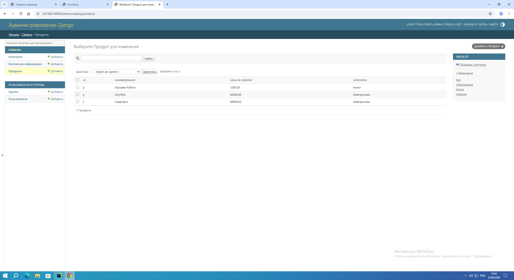
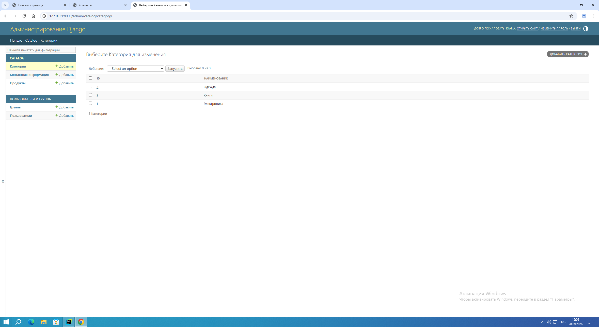

# Интернет-магазин на Django: База данных, модели и фикстуры

Проект представляет собой вторую часть разработки интернет-магазина на веб-фреймворке **Django 5**. В рамках этой работы проект переведён на профессиональную СУБД **PostgreSQL**, реализована связанная структура моделей данных, настроена продвинутая панель администратора, сформированы фикстуры данных, отработаны навыки ORM-запросов в Django Shell и создана кастомная консольная команда для управления базой [jork58, o2AYzq].

## 🎯 Цели и задачи проекта
* Интегрировать СУБД **PostgreSQL** вместо стандартного решения SQLite [jork58].
* Вынести секретные ключи, пароли и настройки подключения базы в изолированные переменные окружения (`.env`) [jork58].
* Разработать связанные модели данных **Продуктов** и **Категорий** с использованием связи `ForeignKey` [jork58].
* Сформировать фикстуры данных формата JSON для категорий и продуктов [Bcxymb].
* Написать кастомную управляющую команду (`management command`), использующую системную утилиту `loaddata` для фикстур [jork58, Bcxymb].
* Отработать базовые CRUD-операции с базой данных через интерактивную консоль **Django Shell** [o2AYzq].

## 🛠️ Выполненные требования и критерии оценки
1. **Переход на PostgreSQL**: Настроено подключение к базе данных. Все зависимости зафиксированы в файле `requirements.txt` [jork58].
2. **Сокрытие данных (.env)**: Секретные настройки вынесены в файл `.env`. В корне репозитория подготовлен демонстрационный файл `.env.sample`. Файл секретов добавлен в `.gitignore` [jork58].
3. **Архитектура моделей**: Созданы две связанные модели — `Category` и `Product`. Организована связь «Один ко многим» через `ForeignKey`. Реализованы методы `__str__` и классы `Meta` с параметрами `verbose_name` и `verbose_name_plural` [jork58].
4. **Фикстуры и кастомная команда**: Сформированы фикстуры в файле `catalog/fixtures/catalog_data.json` [Bcxymb]. Написана кастомная команда `python manage.py fill_db`, которая перед наполнением очищает базу данных от старых категорий и продуктов, а затем корректно загружает фикстуры в БД через встроенную команду `loaddata`, выстраивая связи между объектами [jork58, Bcxymb].
5. **Кастомизация админки**: Для продуктов настроен вывод ID, наименования, цены и категории. Добавлена фильтрация по категориям и поиск по названию/описанию. Для категорий настроен вывод ID и названия [jork58].
6. **Интерактивный Shell**: В консоли Django отработаны операции создания объектов категорий и продуктов, выборки всех записей, фильтрации по внешнему ключу, обновления полей и удаления записей. Скриншоты терминала приложены к отчету [o2AYzq].
7. **Дополнительные задания**: Реализована модель `ContactInfo` для хранения контактов в базе данных. В контроллере главной страницы настроен вывод последних 5 продуктов в консоль при каждом обращении [jork58].

## 🚀 Инструкция по запуску
1. Сделайте копию файла `.env.sample`, назовите её `.env` и укажите ваши параметры подключения к PostgreSQL [jork58].
2. Установите необходимые пакеты:
   ```bash
   pip install -r requirements.txt
   ```
3. Выполните миграции для создания таблиц:
   ```bash
   python manage.py migrate
   ```
4. Наполните базу тестовыми данными из фикстур с помощью нашей кастомной команды [jork58, Bcxymb]:
   ```bash
   python manage.py fill_db
   ```
5. Запустите сервер разработки Django:
   ```bash
   python manage.py runserver
   ```

## 📸 Визуальный отчет о выполнении критериев

### 1. Работа в Django Shell (Запросы ORM)
Ниже представлен скриншот успешного выполнения CRUD-запросов через интерактивную консоль:


### 2. Панель администратора (Продукты)
Настройка отображения, фильтрации по категориям и поиска по названию/описанию для модели продуктов:


### 3. Панель администратора (Категории)
Настройка отображения ID и наименования для модели категорий:



##                            *Лицензия*
Проект распространяется под  **[Apache License]**
